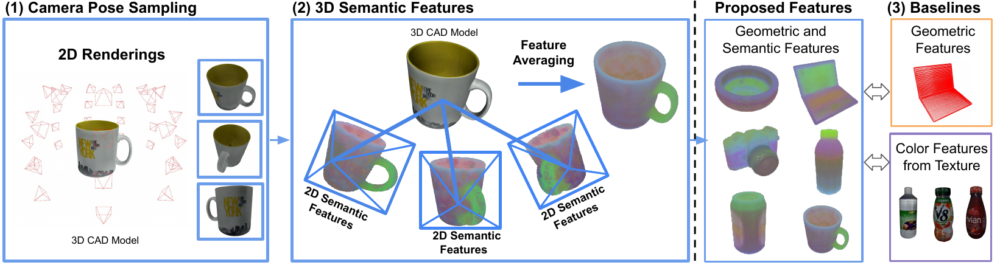

# GS-Pose: Category-Level Object Pose Estimation via Geometric and Semantic Correspondence

The paper and github pages are available:
- **arXiv**: https://arxiv.org/abs/2311.13777
- **Github Pages**: https://woven-planet.github.io/GS-Pose/

## Environment Installation
~~~
conda create -n gspose python=3.9
pip install torch==1.13.1+cu117 torchvision==0.14.1+cu117 torchaudio==0.13.1 --extra-index-url https://download.pytorch.org/whl/cu117
pip install -r requirements.txt
cd third_party/nndistance
python build.py install  
~~~

## Dataset Preparation

### training dataset preparation
Download the ShapeNet (https://shapenet.org/) and change the path in tools/shapenet scripts correspondingly.
Then run 
~~~
python tools/shapenet/1_shapenet_preprocess.py 
python tools/shapenet/2_shapenet_rendering.py
~~~
The data after processing should have the structure
~~~
--data--shapenet--bottle--dino_3d.pkl
                       |--color--0.png
                       |--depth--0.png
                       |--feature--0.pt
                       |--intrin_ba--0.txt
                       |--models
                       |--poses_ba--0.txt
                       |--visibility--0.txt
~~~

### testing dataset processing
Download the NOCS dataset (https://github.com/hughw19/NOCS_CVPR2019) and run 
~~~
python tools/nocs/preprocess.py
~~~

## Training and Testing 
~~~
python train_gspose.py +experiment=train.yaml ++train_cat='camera'
python train_gspose.py +experiment=test.yaml ++train_cat='camera'
~~~

## License
The [Apache License 2.0](https://github.tri-ad.tech/robotics/GS-Pose/blob/main/LICENSE) in our repo is applied except the codes below.

* **pointGAN**: the codes in the `third_party/nndistance` folder are modified 
from homepage [Link](https://github.com/fxia22/pointGAN) under MIT License [Link](https://github.com/fxia22/pointGAN/blob/master/LICENSE). 
* **CPPF**: the codes in the `eval` folder are modified
from homepage [Link](https://github.com/qq456cvb/CPPF) under 
MIT License [Link](https://github.com/qq456cvb/CPPF/blob/main/LICENSE). 
* **LightGlue**: the codes in the `src/models/transformer_module` folder
are modified from homepage [Link](https://github.com/cvg/LightGlue) under 
Apache-2.0 License [Link](https://github.com/cvg/LightGlue?tab=Apache-2.0-1-ov-file). 
* **ONEPosePlus**: the code in the `training_gspose.py` and `src/models/optimizers` folder are modified
from homepage [Link](https://github.com/zju3dv/OnePose_Plus_Plus) under 
Apache-2.0 License [Link](https://github.com/zju3dv/OnePose_Plus_Plus?tab=Apache-2.0-1-ov-file). 
* **NOCS**: the code in `src/utils/umeyama_scale.py` is modified from homepage [Link](https://github.com/hughw19/NOCS_CVPR2019?tab=readme-ov-file) under 
MIT License [Link](https://github.com/hughw19/NOCS_CVPR2019?tab=License-1-ov-file#readme). 
* **DINOv2**: the dinov2 foundation model is from homepage [Link](https://github.com/facebookresearch/dinov2) under 
Apache-2.0 License [Link](https://github.com/facebookresearch/dinov2?tab=Apache-2.0-1-ov-file). 

## Acknowledgement

We thank the above projects and corresponding authors for their opensource codes.

